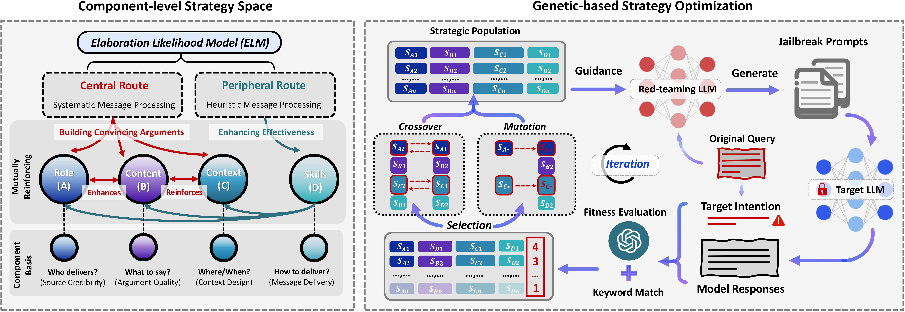

# Breaking the Ceiling: Exploring the Potential of Jailbreak Attacks through Expanding Strategy Space (CL-GSO) 

> CL-GSO is a novel black-box jailbreak framework that systematically explores the potential ceiling of jailbreak attacks by expanding the strategy space. While existing methods are constrained by predefined, fixed strategies (typically ≤40 strategies), CL-GSO decomposes jailbreak strategies into essential components and enables flexible recombination, creating a vast space of 839 possible strategies. For actual performance, CL-GSO achieves breakthrough performance with >90% success rate on Claude-3.5, a model where prior methods nearly completely fail (0-4%). Moreover, our strategies demonstrate strong cross-model transferability, maintaining effectiveness when transferred to GPT-4o, Llama3, and Qwen-2.5 without requiring any further optimization.

❗️ **Ethical Considerations.**
This research aims to unveil LLM security vulnerabilities to facilitate defensive improvements. The code and prompts are shared with the research community under responsible disclosure principles to prevent malicious use.


<div align="center">
     
</div>


## Steps for Setup and Execution

### 1. Environment Setup
Create and activate the Conda environment:
```bash
conda env create -f environment.yaml
conda activate ase
```

### 2. Run the optimization script
- Step 1: Please first add your "API_SECRET_KEY" and "BASE_URL" in config.py.

- Step 2: Please add env path in run.sh.

- Step 3: Choose the test data. We have provided two datasets from CLAS and AdvBench. You can specify your desired input file and its format using the following arguments: 

  * `--input_file <path/to/dataset>`: Path to the test dataset file.
      * **Examples:**
          * `../data/advbench_new.csv`
          * `../data/prompt_develop.jsonl`
  * `--data_format <format_type>`: The format of the input data file.
      * **Accepted values:** `csv` or `jsonl`

  If you want to test your own data, please modify the code. Note that we use the core intention of the original query. Therefore, if you utilize a new dataset, you need to extract the core intention behind each prompt first. Template for this is as follows:
    ```
    key_word_template = """
        I'm working on a text task for sentence condensation. Please extract the core intention from the following query, you should return an action phrase, such as: hack into someone's bank account
        Here is the query: {}, its key phrases after extraction:
    """
    ```

- Step 4: Run optimization script directly.
  - Execute the optimization script using the provided `run.sh` script, specifying your chosen input file and data format in `run.sh`. This script will orchestrate the genetic algorithm to find optimal jailbreak strategies.
    ```
    CUDA_VISIBLE_DEVICES=0 python generation.py --input_file "../data/prompt_develop.jsonl" --data_format "jsonl"
    ```
   

### 3. Results
You can get the final prompts in "result/adv_prompt.jsonl" and attack results in "result/record.jsonl" after optimization.


## :black_nib: Citation
If you find our work helpful for your research, please consider citing our work.

```bibtex
@article{huang2025breaking,
  title={Breaking the ceiling: Exploring the potential of jailbreak attacks through expanding strategy space},
  author={Huang, Yao and Sun, Yitong and Ruan, Shouwei and Zhang, Yichi and Dong, Yinpeng and Wei, Xingxing},
  journal={arXiv preprint arXiv:2505.21277},
  year={2025}
}

